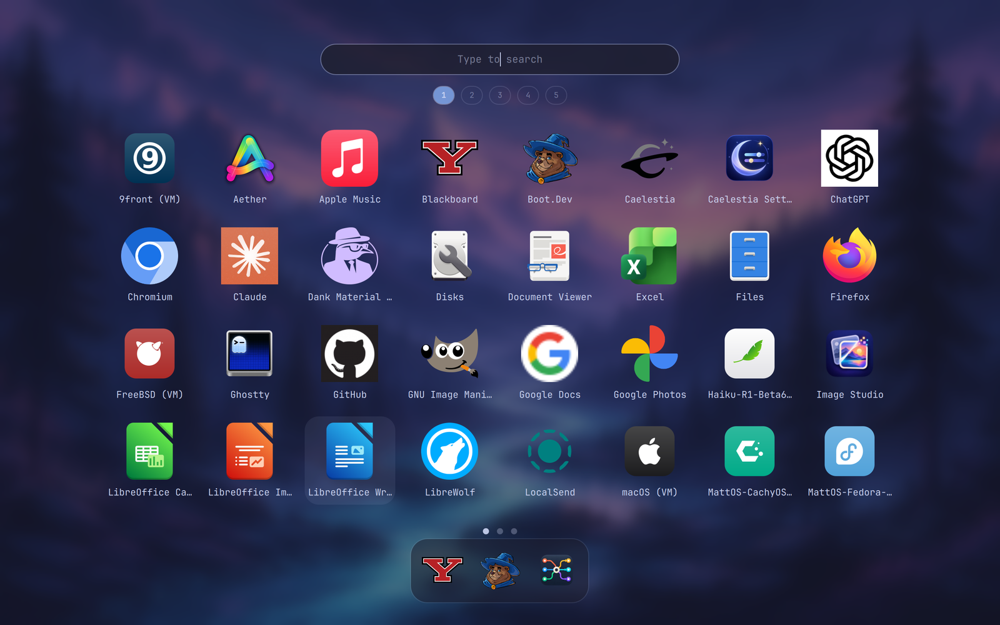

# App Grid

A GNOME-style full-screen app grid for [Omarchy](https://omarchy.org), running
as an omarchy-shell plugin. Paged icons, search, a favourites dash, folders,
drag to reorder, and a workspace strip — opened with a key or a 3-finger swipe
up that follows your fingers the whole way.



Built against Omarchy 4.0.4 (Hyprland 0.56.2, Quickshell 0.3.1).

## Install

```bash
omarchy plugin add https://github.com/matthewjaybarr-png/omarchy-app-grid.git
omarchy plugin enable matthewjaybarr.app-grid
```

Plugins land disabled so you can read the code first; `enable` is the second
step on purpose. Then bind a key — in `~/.config/hypr/bindings.lua`:

```lua
-- SUPER+ALT+SPACE is Omarchy's own apps menu; the system menu stays on
-- SUPER+ESCAPE and SUPER+X either way.
hl.unbind("SUPER + ALT + SPACE")
o.bind("SUPER + ALT + SPACE", "App grid",
  "omarchy-shell shell toggle matthewjaybarr.app-grid '{}'")
```

For the trackpad gesture:

```bash
~/.config/omarchy/plugins/matthewjaybarr.app-grid/gesture.sh on    # off to remove
```

That copies a snippet into `~/.local/state/omarchy/toggles/hypr/`, which
Omarchy sources on every Hyprland reload. Your own `hypr/*.lua` is never
touched. The snippet stands aside while Omari's niri mode is on, since that
binds the same 3-finger slots.

## Using it

**Search** — just type. Enter launches the top hit, arrows/Tab move, Escape
clears and then closes.

**Paging** — scroll, swipe two fingers, PageUp/PageDown, or click the dots.

**Favourites** — right-click a tile and **Pin to favourites** for a dash along
the bottom, or drag a tile onto the dash. Dash icons drag to reorder, and drag
off to unpin.

**Hiding** — **Hide from launcher** drops an app out of the grid. It still
turns up in search, dimmed, so there's always a way back. This is the
plugin's own list; nothing is uninstalled.

**Folders** — drag a tile onto another and hold half a second. The folder
opens into a popup with an editable name; apps leave through their right-click
menu, the whole folder is ungrouped from its own, and a folder that drops
below two apps dissolves itself.

**Reordering** — drag tiles around the grid; hold against an edge to turn the
page. Apps you have never moved keep the library's own ranking and sit after
the arranged ones, which is where a newly installed app belongs.

**Workspaces** — the strip above the grid shows the focused monitor's
workspaces: current in the accent colour, ones with windows filled, empty ones
hollow. Click a pill or press `Ctrl+<n>` to switch, or **drop an app on a pill
to open it there**.

Everything you arrange lives in
`~/.local/state/omarchy/omarchy-app-grid.json` — favourites, hidden apps,
grid order, folders. Delete it to start over.

> **Uninstall… really uninstalls.** The third entry in the right-click menu
> hands off to Omarchy's own `omarchy-remove-launcher-entry`, which deletes
> user `.desktop` files or runs `omarchy-webapp-remove`, `omarchy-tui-remove`,
> `pacman -Rns` or `flatpak uninstall`. It asks for a second click first. If
> you only want an app out of your way, use **Hide from launcher**.

## Removing it

```bash
~/.config/omarchy/plugins/matthewjaybarr.app-grid/gesture.sh off
omarchy plugin remove matthewjaybarr.app-grid
```

and drop the binding you added.

## Notes

- Icons: Omarchy's icon index keeps the first file `find` returns per name,
  which in hicolor is usually the 16x16 PNG and looks mushy at grid size. The
  grid re-indexes PNGs by pixel size and overrides only the names that
  resolved to one.
- Multi-monitor: the grid follows `Hyprland.focusedMonitor` and the workspace
  strip lists that monitor's workspaces. The strip is tested with a headless
  output; the grid itself has only ever run on one display, so that part is
  reasoned rather than tested. Reports welcome.
- `omarchy-shell shell call matthewjaybarr.app-grid debugState x` dumps the
  grid's state as JSON (the trailing argument is required). Handy in a bug
  report.

## Hacking on it

```bash
ln -sfn "$PWD" ~/.config/omarchy/plugins/matthewjaybarr.app-grid
omarchy-shell shell rescanPlugins    # the shell's watcher doesn't follow symlinks
```

`Launcher.qml` is a small wrapper that loads `LauncherView.qml` from a
`?v=<timestamp>` URL. A `keepLoaded` plugin keeps its compiled component when
the shell clears its cache, so without that indirection a rescan wouldn't pick
up your edits; changes to `Launcher.qml` itself still need
`omarchy restart shell`.

MIT licensed.
